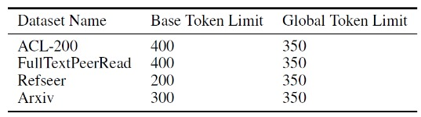

## Dataset Download Links:
- Link to our preprocessed base datasets: https://drive.google.com/drive/folders/1WlqlTkSj8LwihbrQvBX5F9_0uZAGGhiE?usp=drive_link

- Link to our preprocessed global datasets: https://drive.google.com/drive/folders/1JH34nEXt8_p-0P9A--aQHK4yBXQfJe4v?usp=drive_link

- (Optional) Link to the original datasets: https://drive.google.com/drive/folders/11n4YVHgUPfzetJi-y5voFpmRIjiBM0lQ

- Link to our pretrained models: https://drive.google.com/drive/folders/1OBg6W3kQw4VWPMfrXEPxN8LzTopR1jak?usp=drive_link

## Dependencies:

- `conda create --name "env_name" python=3.8`
- `conda activate "env_name"`
- `pip3 install torch torchvision torchaudio`   # Use an appropriate PyTorch version from https://pytorch.org/get-started/locally/ according to your CUDA version.
- `pip install transformers transformers[torch] datasets`

## Preprocessing the Datasets from Scratch (Optional, Not Recommended):

1. Download the original datasets from the above link. Place them inside the "preprocessing/original_datasets" folder. For example, the two files downloaded for ACL200 dataset should be placed inside a folder named "acl200_original" under the "preprocessing/original_datasets" folder.
2. You can preprocess each dataset for both base and global techniques using their corresponding code in the "preprocessing" folder.
3. Select the code for your chosen dataset. Modify its first few lines to provide the input and output path for the code. Inputs should be the path of two files that belong to the original dataset. Outputs are going be the paths and the names of the preprocessed dataset files.
4. After the chosen preprocessinf code is complete, there should be 4 new files generated inside the given output path. One of these files is the complete version of the preprocessed dataset. Training and evaluation splits of this complete dataset file are also created. Lastly, a complete list of unique author-date citations has been provided in another file as well.

## Steps to reproduce our results:
1. After cloning the project, make sure the following folders are inside the main project folder: "checkpoints" and "models".
2. Create a new conda environment and install the dependencies shown in "Dependencies" section.
3. Download our preprocessed datasets for both base and global technique from the Google Drive links above.
4. (Optional) Alternatively, follow the steps shown in "Preprocessing the Datasets from Scratch" section above to recreate our preprocessed datasets.
5. Place each preprocessed dataset inside its corresponding folder in the "cit_data" folder.
6. To run the code, use the provided scripts inside the "train/scripts" folder. 
7. (Optional) You can modify the parameters inside the scripts beforehand.
8. Directly run the corresponding script for the chosen dataset inside the "train/scripts" folder. 

## Example Run Scenario for Peerread Base:
1. Clone the project, and install the dependencies.
2. Download "peerread_base" dataset from Google Drive.
3. Place the three downloaded files inside "cit_data/peerread_base" folder.
4. Go inside the "train/scripts" folder and open the "run_CiteBART_peerread_base.sh" in order to modify its parameters. For example, you can change "num_epochs" parameter to 1, for a quick validation trial.
5. Run the "run_CiteBART_peerread_base.sh" script to perform training on the peerread base dataset. The results will be printed on the terminal after the training.

## Utils Folder Overview

The utils directory contains helper scripts for dataset analysis, qualitative inspection, and model evaluation.

- base_version_generate_qualitative_analysis.py & global_version_generate_qualitative_analysis.py -->
Generate and display masked contexts along with their top 10 predicted citations for both dataset types.

- data_statistic_utils.py --> 
Compute and visualize various dataset statistics.

- hallucination_analysis_global.py -->
Identify and inspect potential hallucinations generated by the CiteBART model.

- utils/llm_analysis -->
Contains implementations of four different approaches for evaluating LLM performance on the LCR task.

## Further Details on Token Limits

Before pre-training with citation objectives, we ensured that each context has its mask token in its middle position after tokenization. Another critical aspect was the determination of correct lengths for citation contexts. We limited citation contexts in each dataset to an optimal number of tokens to avoid increasing time and memory costs. An exploratory analysis of context lengths shows that the contexts of ACL-200 and Peerread are significantly longer than those of the other datasets. After tokenization, we observed that $200-400$ tokens were optimal for all base datasets. This limit allows sufficiently long contexts without a need for excessive amounts of padding tokens. As an exception, ACL-200 has $607$ contexts that exceed the $400$ limit. We have shortened them to the $400$ token limit as they correspond to a small proportion of the whole number of contexts and also because the number of discarded tokens is negligible.

For each global dataset, we chose the token limit as $350$. Since abstracts require a higher number of tokens, we limited the local context sizes to $100$ for the global versions of the datasets. We also ensured that there are $50$ tokens each on the left and right sides of the <mask> tokens. We used a token limit of $200$ for abstracts for all datasets since most abstracts can fit into it. Table above shows the maximum token limits for both the base and global training schemes.

The token limits during training can be adjusted by modifying the "max_token_limit" parameter in the training scripts. The datasets we provided have also been created according to these token limits. If you are preprocessing the datasets from scratch, you can modify the context and/or abstract token limit parameters inside the preprocessing codes.

## Further Details on Training and Evaluation Times

We conducted our experiments on devices with NVIDIA RTX6000 Ada GPU and NVIDIA V100 GPU for Global and Base datasets, respectively. For global datasets, the pre-training for Peerread and ACL-200 lasts for $2$ and $6$ hours, respectively. The larger datasets, Arxiv and Refseer, take up to $8-9$ days since they have similar sizes. For base datasets, the training for the smaller datasets, Peerread and ACL-200, lasts for 8 and 20 hours, respectively. The larger datasets, Arxiv and Refseer, take up to 14-15 days. However, we believe these relatively longer times are the result of training on the device with NVIDIA V100 GPU.

Our evaluation of the corresponding test sets takes considerable time since generating the top 10 predictions for each example is resource-intensive. Especially with our limited hardware resources, acquiring the results on the larger datasets takes up to 2 days. The smaller datasets require less time, 20 minutes for Peerread and 2 hours for ACL-200. We performed our evaluations on the device with NVIDIA RTX6000 Ada GPU.

The issue of slow evaluation for larger datasets is not exclusive to our work. Hatten et al., 2022 reported their results using only a smaller subsection (10K) of the test sets due to long evaluation times.

